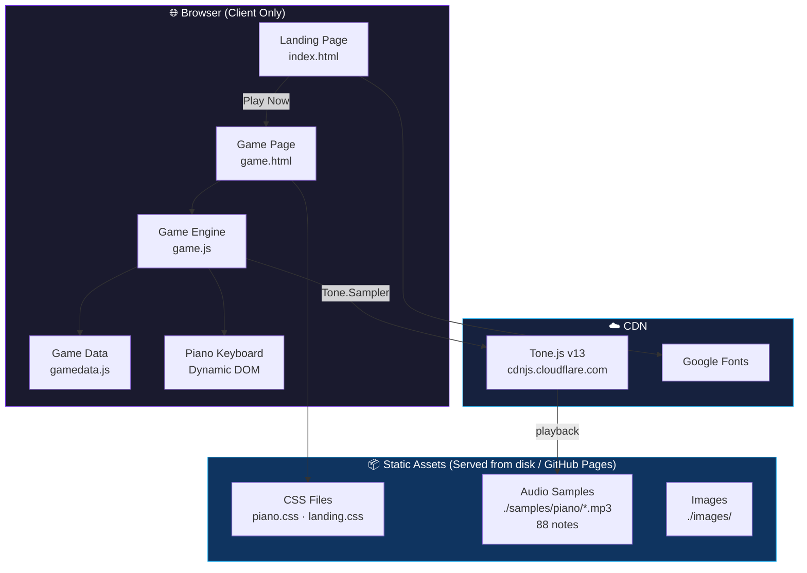
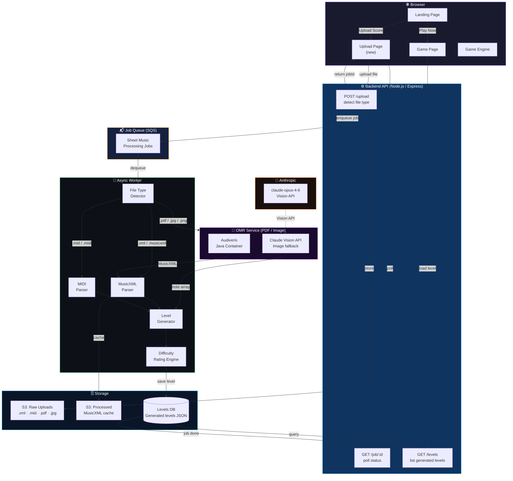
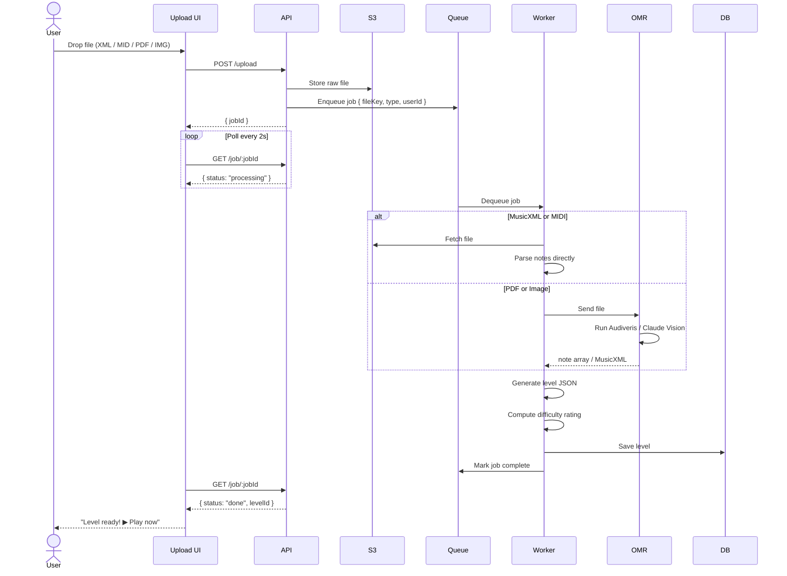
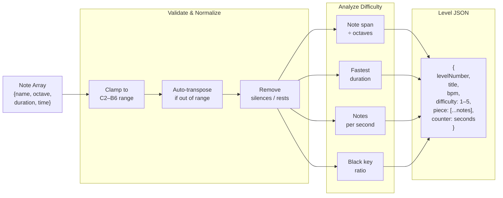
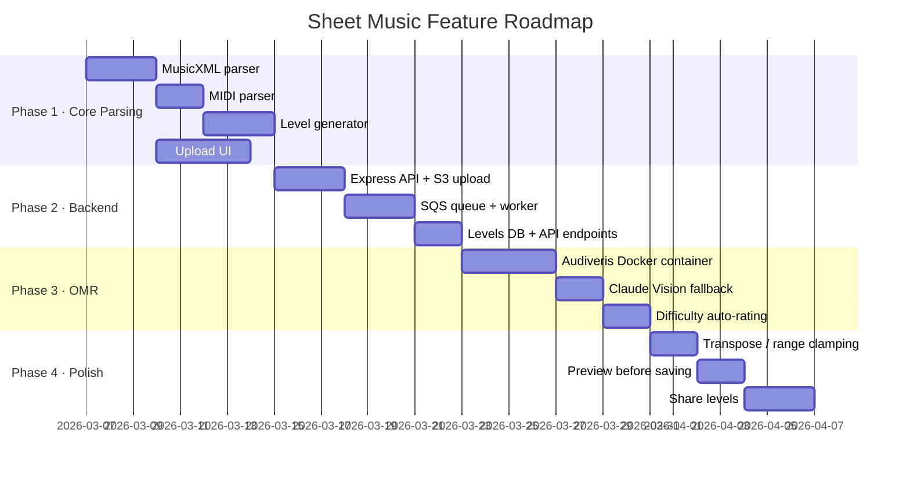

# Bach to Bach — Solution Architecture

## Current State

---

## Proposed: With Sheet Music Upload

---

## Data Flow: Sheet Music → Level

---

## Level Generator Logic

---

## File Type Support

| Format | Parser | Reliability | Notes |
|---|---|---|---|
| `.xml` / `.musicxml` | `musicxml-interfaces` (Node) | ★★★★★ | Export from MuseScore (free) |
| `.mid` / `.midi` | `@tonejs/midi` (Node) | ★★★★★ | Widely available |
| `.pdf` | Audiveris (Java container) | ★★★★☆ | Best for printed scores |
| `.jpg` / `.png` | Claude Vision API | ★★★☆☆ | Fallback for photos |

---

## Implementation Phases

