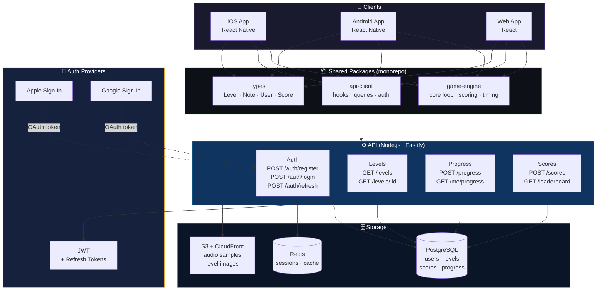
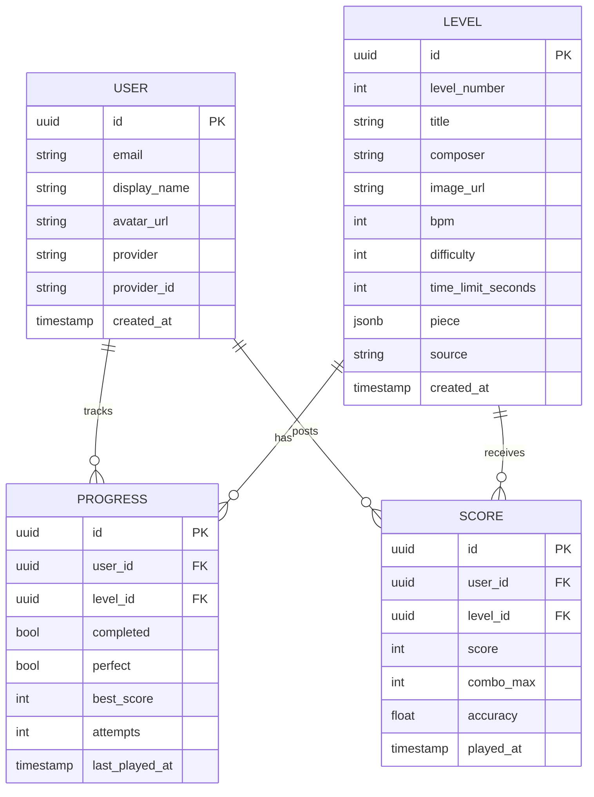
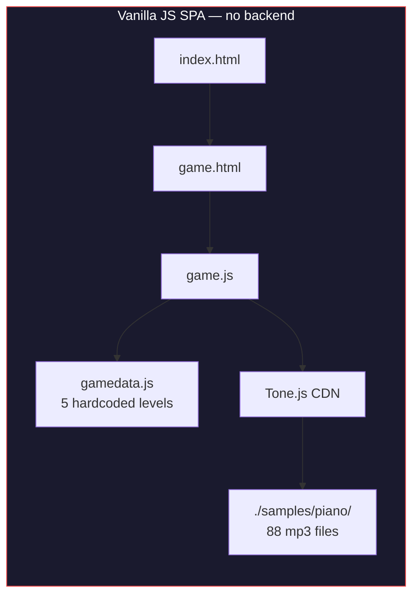
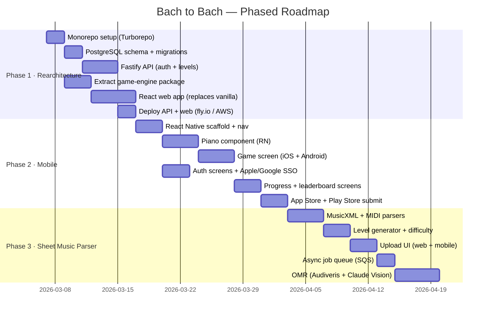
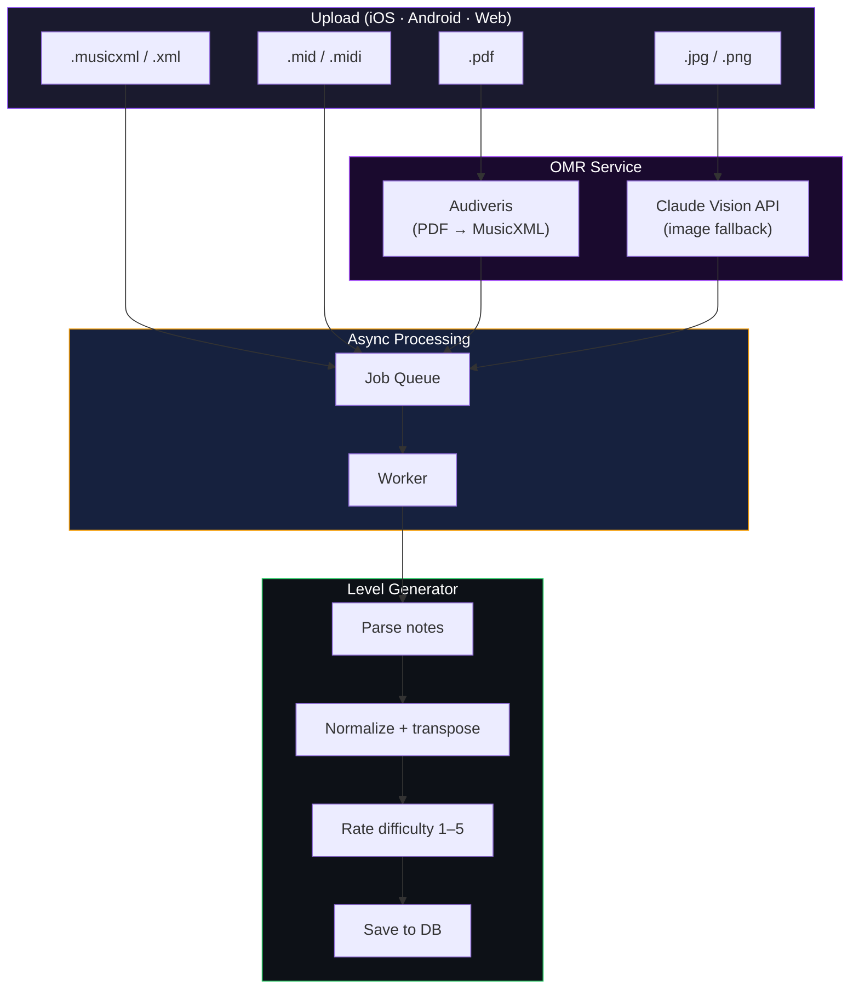

# Bach to Bach — Solution Architecture

---

## Technology Stack

| Layer | Technology |
|---|---|
| **Frontend (Web)** | React, Vanilla JS (current) |
| **Frontend (Mobile)** | React Native (iOS + Android) |
| **Audio engine** | Tone.js |
| **Audio samples** | 88-key piano samples (MP3 / OGG) |
| **Backend API** | Node.js · Fastify |
| **Database** | PostgreSQL |
| **Cache / Sessions** | Redis |
| **File storage** | S3 + CloudFront |
| **Auth** | JWT + Refresh Tokens · Apple Sign-In · Google Sign-In |
| **Monorepo tooling** | Turborepo |
| **Shared types** | TypeScript |
| **Sheet music parsing** | MusicXML · MIDI · Audiveris (OMR) · Claude Vision API |
| **Job queue** | AWS SQS |

---

## Target Architecture



---

## Monorepo Structure

```
bachtobach/
├── apps/
│   ├── mobile/                  ← React Native (iOS + Android)
│   │   ├── ios/
│   │   ├── android/
│   │   └── src/
│   │       ├── screens/         Landing · Game · Leaderboard · Profile
│   │       ├── components/      Piano · NoteBar · ScoreDisplay
│   │       └── navigation/
│   │
│   ├── web/                     ← React (browser)
│   │   └── src/
│   │       ├── pages/           Landing · Game · Leaderboard
│   │       └── components/      Piano · NoteBar · ScoreDisplay
│   │
│   └── api/                     ← Node.js · Fastify
│       └── src/
│           ├── routes/          auth · levels · progress · scores
│           ├── db/              migrations · queries (Postgres)
│           └── middleware/      auth guard · rate limit
│
└── packages/
    ├── game-engine/             ← platform-agnostic game logic
    │   ├── scheduler.ts         note timing via Tone.js / Native Audio
    │   ├── comparator.ts        note comparison · scoring
    │   └── difficulty.ts        difficulty rating
    ├── api-client/              ← React Query hooks for all endpoints
    └── types/                   ← shared TypeScript types
```

---

## Database Schema



---

## API Endpoints

| Method | Route | Auth | Description |
|---|---|---|---|
| `POST` | `/auth/register` | — | Email + password signup |
| `POST` | `/auth/login` | — | Returns JWT + refresh token |
| `POST` | `/auth/oauth` | — | Apple / Google Sign-In |
| `POST` | `/auth/refresh` | — | Rotate tokens |
| `GET` | `/levels` | ✓ | List all levels (with user progress) |
| `GET` | `/levels/:id` | ✓ | Level detail + note sequence |
| `POST` | `/progress` | ✓ | Save level completion |
| `GET` | `/me/progress` | ✓ | All user progress |
| `POST` | `/scores` | ✓ | Submit score after level |
| `GET` | `/leaderboard` | ✓ | Top scores per level |
| `GET` | `/me` | ✓ | User profile |

---

## Current State (what exists today)



**Gaps to close during rearchitecture:**
- No user accounts or progress persistence
- Levels hardcoded in JS — no content management
- No leaderboard or social features
- Web-only — no iOS or Android
- Audio samples served as static files (no CDN)

---

## Implementation Roadmap



---

## Sheet Music Pipeline (Phase 3, detail)


